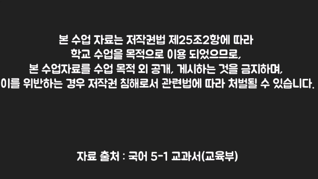

# 뉴딜 자료 모음

## 학교의 저작물 이용범위 확대 기반 마련
> 교사가 저작물 걱정 없이 원격수업에 저작물을 활용‧재구성할 수 있도록 
> 저작물의 이용범위 확대, 자유로운 이용 환경 조성

### 1. 현상황
- case 1. 직접 자료 수집 후 교육자료 제작 & 안내문 삽입

    

- case 2. 교과서에서 발췌한 내용으로만 교육자료 제작
- case 3. 교사 커뮤니티의 교육자료 사용
    * [초등 인디스쿨(폐쇄형 교사 커뮤니티)](https://indischool.com/)
    * [참쌤스쿨 (교육자료 공유 블로그)](https://chamssaem.com/)
    * [초등 아이스크림 (폐쇄형 교육자료 판매 서비스)](http://www.i-scream.co.kr/user/main/MainPage.do?sso=ok)
    * [티셀파 (교육자료 판매 서비스)](http://www.tsherpa.co.kr/main/main.aspx/)
    * [에듀넷 - 지식샘터 (정부운영 교사 지식공유 서비스)](https://educator.edunet.net/)

### 2. 착안점
- 저작물 문제로 교육자료 제작의 어려움과 퀄리티 저하
- 저작물인지 모르고 사용하는 경우 법적 문제 발생 가능성

### 3. 공모전 아이디어
- 빅데이터 기반 교육 자료 제작 도구
    * 구글 독스, 프레젠테이션 + 저작물 검사기 (유튜브) + 더빙

## K-MOOC 우수콘텐츠 확대 및 운영체계 혁신, 플랫폼 강좌 유료서비스 도입
> 고등교육기관 등의 우수강좌를 온라인으로 공개하여 고등교육에 대한 평생교육 수요 확대에 부응하고, 대학의 교수·학습 혁신 촉진

> (차세대 플랫폼 구축) AI·빅데이터 기반 개인 맞춤형 강좌 추천, 다양한 교수법(가상실습, 대화형 학습 등) 구현 가능한 플랫폼 구축

### 1. 착안점
- 기존 비디오 강좌의 단방향성
- 기간이 지날수록 노후되는 비디오 강좌

### 2. 공모전 아이디어
- 머신러닝 기반 진화형 강의
    * 크라우드 소싱
        * 수강생 <=> 수강생 (협동과제, 상호채점)
        * 강좌 <=> 수강생 (온라인 과제, 퀴즈)
    * 머신러닝
        * 크라우드 소싱으로 얻은 데이터들을 활용하여 이수율, 학습률이 높은 쪽으로 강의가 스스로 진화하게 설계(강의 내용, 과제, 퀴즈, QnA 등)
